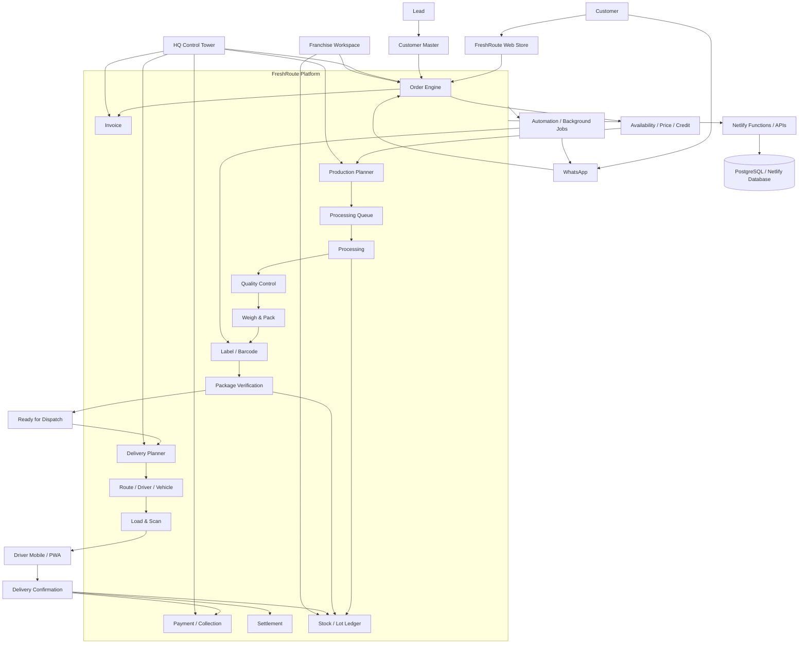

# FreshRoute Architecture

## Purpose

FreshRoute is one operational platform for HQ, franchises, processing, packing, delivery and customers. The initial deployment is intentionally lean and can scale infrastructure as real business volume grows.

## Architecture diagram

## One platform, role-based experiences

- **HQ/Admin:** customers, orders, production, inventory, pricing, delivery planning, finance, franchises and exceptions.
- **Processing/Packing:** production queue, QC, weighing, labels, packing and scan verification.
- **Delivery:** assigned route, stops, package scans, navigation, proof of delivery and collections.
- **Franchisee:** customers, orders, supply, stock, outlets and local deliveries scoped to the franchise.
- **Customer:** web ordering, order status, invoices, payments and reorder.
- **WhatsApp:** an order channel connected to the same order engine, not a separate business system.

## Data architecture

The MVP can use the current Netlify PostgreSQL foundation and evolve incrementally. As automation becomes production-critical, core relationships should move from generic operational JSON records to explicit relational entities:

- customers and addresses
- orders and order_items
- production_orders and processing_batches
- qc_checks
- stock_lots
- packages and package_items
- labels
- delivery_routes and delivery_stops
- drivers and vehicles
- invoices and payments
- settlements
- audit/event records

The objective is one source of truth: one customer/order/package should not be recreated independently by processing, packing, delivery or finance.

## Automation principle

Routine transitions should be system-driven. People handle exceptions.

**Confirmed order → production requirement → processing → QC → weighing → label → packing scan → dispatch-ready → route → loading scan → delivery → invoice/payment/settlement.**

Important transitions should create an auditable event and be safe to retry without creating duplicates.

## Initial scale strategy

Initial target:

- 10–15 franchises
- 100 orders/franchise/day
- approximately 1,000–1,500 orders/day
- approximately 30,000–45,000 orders/month

Use the low-cost Netlify/PostgreSQL deployment during development and pilot operations. Measure real usage before paying for larger infrastructure.

Scale based on actual database latency, storage, connections, function duration, background-job volume and API traffic.

## Evolution path

1. **MVP:** one FreshRoute web/PWA, Netlify Functions, managed PostgreSQL.
2. **Pilot:** proper indexes, relational core tables, background jobs and monitoring.
3. **Growth:** dedicated workers for WhatsApp, labels, notifications, routing and reporting; add queues/caching where needed.
4. **Large scale:** scaled PostgreSQL, read replicas, queues, workers, observability and service separation only where justified.

## Key architectural rule

**One business platform, one source of truth, multiple role-based experiences and multiple external channels.**

Do not create separate databases for HQ, franchises, processing or delivery.
